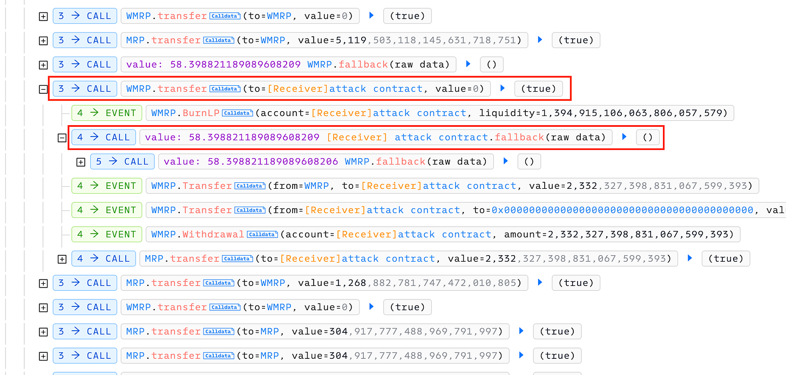

# GuildAcademy-Hacks-Lab

## Exploit analysis for the WMRP exploit which happend on bnb chain

[Transaction of the hack here](https://bscscan.com/tx/0x4353a6d37e95a0844f511f0ea9300ef3081130b24f0cf7a4bd1cae26ec393101)

Exploit Analysis
The exploit targeted a flaw in the WMRP contract during the removal of liquidity. Here’s a step-by-step breakdown of the attack:

1. The attacker exploited a reentrancy vulnerability in the WMRP contract. This type of vulnerability allows the attacker to repeatedly call a function before the previous executions are completed.

2. When the WMRP contract attempted to remove liquidity, it triggered the attacker's fallback function. This function is automatically called when a contract receives funds, allowing the attacker to manipulate the process.

3. The issue stemmed from the \_removeLiquidity function within the transfer function. The attacker transferred the WMRP token to themselves with a value of 0, triggering the reentrancy vulnerability.



4. By hooking into the transfer function, the attacker was able to re-enter the contract’s receive function. This allowed them to transfer BNB back to the WMRP contract, exploiting the system to obtain more MRP tokens than allowed.

5. Ultimately, the attacker drained all the BNB from the WMRP contract by continuously exploiting the transfer function flaw.

## Instructions to run the repro of the exploit

```bash
cd /WMRP-cross-function-reentrancy
forge test --mt test_steal_funds -vvvvvv
```
